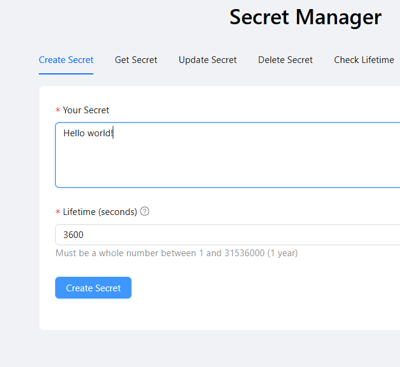
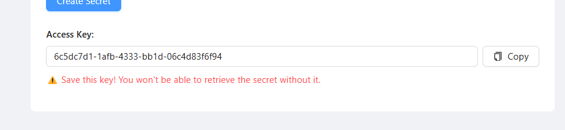
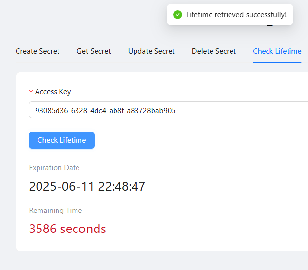

# Secret Sharing Platform (Fullstack)

  
*Пример интерфейса приложения*
  
*Пример интерфейса приложения*
  
*Пример интерфейса приложения*

## 🔍 Описание

Сервис для безопасного обмена конфиденциальными данными с автоматическим удалением по истечении срока действия. Реализован как fullstack-приложение с микросервисной архитектурой.

## 🛠 Технологический стек

### **Backend** (FastAPI)
- **Асинхронное программирование**: ASGI-сервер (Uvicorn) для высокой производительности
- **PostgreSQL**: Реляционная БД с asyncpg для асинхронного доступа
- **Redis**: Кэширование и временное хранение метаданных
- **APScheduler**: Фоновый планировщик для автоматического удаления просроченных секретов
- **Alembic**: Управление миграциями БД с возможностью генерации новых версий схемы
- **Fernet (cryptography)**: 
  - Автогенерация ключа шифрования при первом запуске
  - Симметричное шифрование данных
  - UUID4 в качестве идентификаторов записей

### **Frontend** (React 18)
- **Vite**: Современный сборщик для быстрой разработки
- **Ant Design**: Готовые UI-компоненты профессионального уровня
- **Интуитивный интерфейс**: 
  - Адаптивный дизайн
  - Валидация форм
  - Визуализация состояния

### **Infrastructure**
- **Docker**: 
  - Изолированные сервисы (backend, frontend, DB, Redis)
  - Автоматическая генерация окружения
  - Persistence данных через volumes
- **Docker Compose**: Оркестрация мультиконтейнерного приложения

## 🚀 Запуск проекта

```bash
# 1. Клонирование репозитория
git clone https://github.com/Imarzhobaboba/confidential_data_keeper.git
cd confidential_data_keeper

# 2. Запуск (сборка + инициализация)
docker-compose up --build -d

# 3. Доступ к приложению
http://localhost:5173